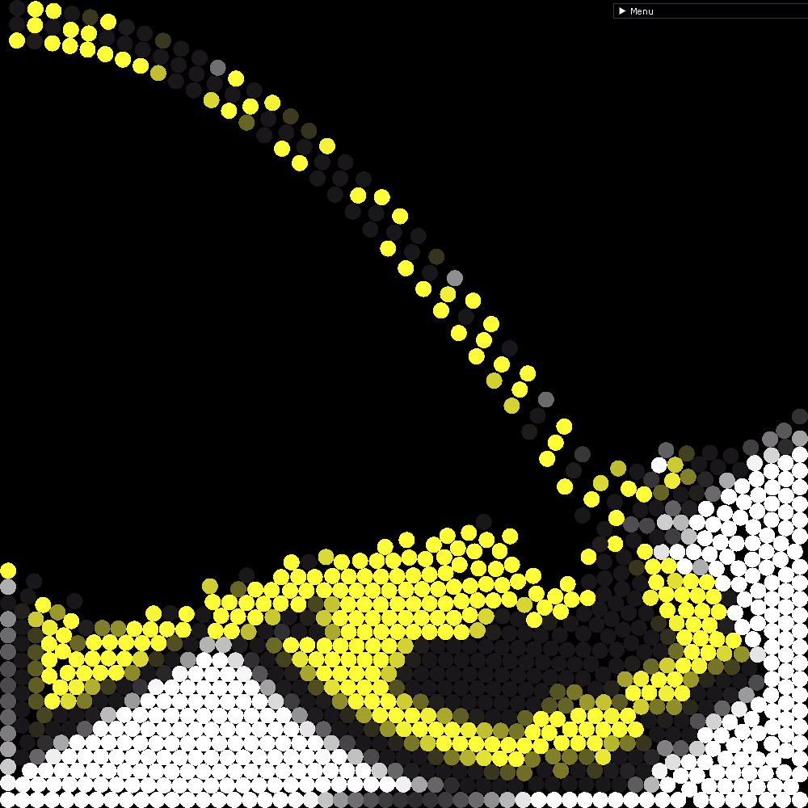

# Particles

## Very simple particle physics simulation, with image rendering

Inspiration: https://youtu.be/lS_qeBy3aQI

Example:

  
   
  

*******
 1. [Compiling/Running](#Compiling/Running)
 2. [Customizing simulation](#Customizing_simulation)
 3. [Current state](#Current_state)
*******

<!-- ## Installing

Currently make install has not been implemented

******* -->

## Compiling/Running

(Will probably not work outside of linux with gcc/g++ for now)

Download source code **recursivelly**, i.e. `git clone git@github.com:IVSOP/Particles.git --recursive`

   ### Dependencies
   * CMake

   ### Compiling and Running
   * Use the script `run.sh` to compile and run

*******

## Customizing simulation

(For now, image path is hardcoded)

An example is provided in main.cpp.
You start by making a simulator, specifying max particles, the size of the grid and the particle radius.
You can then create spawners, indicating:
* start tick (tick where it begins spawning)
* total ticks (ends after it runs for this amount of ticks)
* spawn frequency (how many ticks it takes to trigger a spawn)
* tick offset (to change what tick the spawner thinks the simulation is at)
* start_x, y, start_accel_x, y (values for the spawner functions)
* the spawner function itself

Then, you can simulate for N ticks, and calculate the colors the particles landed at

After (soft) reseting everything, running it will display the result
*******

## Current state

This is a personal project I created to learn OpenGL and physics simulations. It is coded in C++ and simulates particle movement using Verlet integration. It is a major rewrite from a previous project, since I became much better overall and felt like it
deserved a rewrite. This way I used what I learned to make something much simpler and structured than whatever that was (it is still public, go check it out).
Currently, it runs better on one thread than the previous one did with 8 threads and SIMD.

Currently, there is only a rectangle constraint, and no other gravity sources.

There is also no SIMD or multi-threading, but I will implement them when I can.

*******
